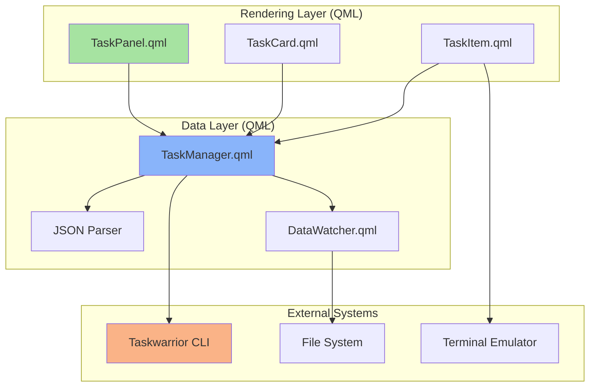

# Design Document: Taskwarrior Quickshell Panel

## Overview

The Taskwarrior Quickshell Panel integrates Taskwarrior task management into the Quickshell desktop environment, providing a visual interface for task navigation organized by client context. The design maintains Taskwarrior CLI as the source of truth while enabling quick visual updates and navigation through the Quickshell UI.

### Key Design Principles

1. **CLI as Source of Truth**: All task data originates from Taskwarrior's JSON export; the panel is a read-mostly interface with minimal write operations (status updates only)
2. **Client-Centric Organization**: Tasks are grouped by the `client` custom attribute, enabling context-focused workflows
3. **Single-Focus Interaction**: Only one task card expands at a time, reducing cognitive load
4. **Non-Blocking Operations**: All Taskwarrior commands execute asynchronously to maintain UI responsiveness
5. **Architectural Separation**: Clear boundaries between data layer (Taskwarrior interaction) and rendering layer (QML UI)

### Technology Stack

- **Frontend**: QML (Qt Quick) within Quickshell framework
- **Data Source**: Taskwarrior CLI (`task export` JSON output)
- **Process Execution**: Quickshell Process component with StdioCollector
- **File Watching**: QML FileSystemWatcher or polling-based refresh
- **Terminal Integration**: Hyprland compositor with floating window support

## Architecture

### Component Overview



### Layer Responsibilities

#### Data Layer (TaskManager.qml, DataWatcher.qml)

**Responsibilities:**
- Execute `task export` command and parse JSON output
- Group tasks by `client` attribute value
- Detect Taskwarrior data changes via file watching or polling
- Execute task modification commands (status updates)
- Expose task data through QML properties and signals

**Does NOT:**
- Render UI components
- Handle user interaction events directly
- Maintain UI state (expansion, selection)

#### Rendering Layer (TaskPanel.qml, TaskCard.qml, TaskItem.qml)

**Responsibilities:**
- Display task cards organized by client
- Handle user interactions (clicks, expansions)
- Manage card expansion state (single-focus behavior)
- Trigger terminal launches for task detail navigation
- Apply visual styling and animations

**Does NOT:**
- Execute Taskwarrior commands directly
- Parse JSON data
- Monitor file system changes

## Components and Interfaces

### TaskManager.qml (Data Layer)

**Purpose**: Central data management component that interfaces with Taskwarrior CLI

**Properties:**
```qml
QtObject {
    id: taskManager
    
    // Exposed data
    property var tasksByClient: ({})  // Map: client_name -> [tasks]
    property var generalTasks: []     // Tasks without client attribute
    property bool isLoading: false
    property string errorMessage: ""
    
    // Configuration
    property int refreshInterval: 7000  // milliseconds (7 seconds)
    property bool useFileWatcher: true
    
    // Signals
    signal tasksUpdated()
    signal taskModified(string uuid, bool success)
    signal errorOccurred(string message)
}
```

**Methods:**
```qml
// Load tasks from Taskwarrior
function refreshTasks()

// Modify task status
function updateTaskStatus(uuid, newStatus)

// Get task count for a client
function getTaskCount(clientName)
```

**Implementation Details:**
- Uses Quickshell `Process` component to execute `task export`
- Parses JSON using JavaScript `JSON.parse()`
- Groups tasks by iterating through parsed array and checking `client` attribute
- Tasks without `client` attribute go to `generalTasks` array
- Emits `tasksUpdated` signal when data refresh completes

### DataWatcher.qml (Data Layer)

**Purpose**: Monitor Taskwarrior data directory for changes and trigger refreshes

**Properties:**
```qml
QtObject {
    id: dataWatcher
    
    property string taskDataPath: ""  // Path to ~/.task directory
    property bool enabled: true
    
    signal dataChanged()
}
```

**Implementation Approaches:**

**Option 1: File System Watcher (Preferred)**
```qml
FileSystemWatcher {
    id: fsWatcher
    paths: [dataWatcher.taskDataPath + "/pending.data",
            dataWatcher.taskDataPath + "/completed.data"]
    onPathChanged: dataWatcher.dataChanged()
}
```

**Option 2: Polling Fallback**
```qml
Timer {
    id: pollTimer
    interval: taskManager.refreshInterval
    running: dataWatcher.enabled
    repeat: true
    onTriggered: dataWatcher.dataChanged()
}
```

### TaskPanel.qml (Rendering Layer)

**Purpose**: Main container component that displays all task cards

**Structure:**
```qml
ColumnLayout {
    id: taskPanel
    
    // Header
    RowLayout {
        Text { text: "Tasks" }
        Button { 
            text: "🔄"
            onClicked: taskManager.refreshTasks()
        }
    }
    
    // Task cards
    ScrollView {
        ListView {
            model: taskCardModel
            delegate: TaskCard {}
        }
    }
    
    // Status indicator
    Text {
        text: taskManager.isLoading ? "Loading..." : 
              `${totalTaskCount} tasks`
    }
}
```

**Responsibilities:**
- Instantiate TaskManager
- Build ListModel from taskManager.tasksByClient
- Display loading/error states
- Provide manual refresh button

### TaskCard.qml (Rendering Layer)

**Purpose**: Collapsible card representing all tasks for a single client

**Properties:**
```qml
Rectangle {
    id: taskCard
    
    property string clientName: ""
    property var tasks: []
    property bool isExpanded: false
    
    // Visual states
    states: [
        State {
            name: "compact"
            when: !isExpanded
            PropertyChanges { target: taskList; visible: false }
            PropertyChanges { target: taskCard; height: 60 }
        },
        State {
            name: "expanded"
            when: isExpanded
            PropertyChanges { target: taskList; visible: true }
            PropertyChanges { target: taskCard; height: taskList.contentHeight + 60 }
        }
    ]
    
    transitions: Transition {
        NumberAnimation { properties: "height"; duration: 200; easing.type: Easing.InOutQuad }
    }
}
```

**Compact Mode Display:**
- Client name (or "General" for tasks without client)
- Task count badge
- Optional priority indicator (e.g., red dot if any task has priority H)

**Expanded Mode Display:**
- All tasks in a ListView
- Each task rendered by TaskItem component

**Interaction:**
- Click anywhere on card header to toggle expansion
- When expanding, emit signal to TaskPanel to collapse other cards

### TaskItem.qml (Rendering Layer)

**Purpose**: Individual task display with status button and detail navigation

**Structure:**
```qml
Rectangle {
    id: taskItem
    
    property var task: null  // Task object from JSON
    
    RowLayout {
        // Status button
        Button {
            text: getStatusIcon(task.status)
            onClicked: {
                taskManager.updateTaskStatus(task.uuid, "completed")
            }
        }
        
        // Task description
        ColumnLayout {
            Text {
                text: task.description
                font.bold: task.priority === "H"
            }
            
            // Metadata row
            RowLayout {
                // Priority indicator
                Rectangle {
                    visible: task.priority
                    color: getPriorityColor(task.priority)
                    width: 8; height: 8; radius: 4
                }
                
                // Tags
                Repeater {
                    model: task.tags || []
                    Text {
                        text: "#" + modelData
                        font.pixelSize: 9
                        color: "#89b4fa"
                    }
                }
                
                // Due date
                Text {
                    visible: task.due
                    text: formatDueDate(task.due)
                    font.pixelSize: 9
                    color: isOverdue(task.due) ? "#f38ba8" : "#a6adc8"
                }
            }
        }
        
        MouseArea {
            anchors.fill: parent
            onClicked: openTaskInTerminal(task.uuid)
        }
    }
}
```

**Status Button Behavior:**
- Displays current status as icon (e.g., ⭕ pending, ✓ completed)
- Click toggles between pending/completed
- Immediately updates visual state (optimistic UI)
- Calls taskManager.updateTaskStatus() in background

**Detail Navigation:**
- Click on task description area opens terminal
- Executes: `kitty --class floating -e task <uuid> edit` (or similar)
- Uses non-blocking Process execution

## Data Models

### Taskwarrior JSON Structure

Taskwarrior's `task export` command outputs JSON array of task objects:

```json
[
  {
    "id": 1,
    "uuid": "a360fc44-315c-4366-b70c-ea7e7520b749",
    "description": "Complete design document",
    "status": "pending",
    "entry": "20240115T120000Z",
    "modified": "20240115T120000Z",
    "priority": "H",
    "tags": ["work", "documentation"],
    "due": "20240120T000000Z",
    "client": "acme-corp"
  },
  {
    "id": 2,
    "uuid": "b470fc44-315c-4366-b70c-ea7e7520b750",
    "description": "Review pull request",
    "status": "pending",
    "entry": "20240115T130000Z",
    "modified": "20240115T130000Z",
    "tags": ["code-review"]
  }
]
```

**Key Fields:**
- `uuid`: Unique identifier (preferred over `id` for commands)
- `description`: Task title
- `status`: pending, completed, deleted, waiting
- `priority`: H (high), M (medium), L (low), or undefined
- `tags`: Array of tag strings
- `due`: ISO 8601 timestamp
- `client`: Custom UDA (User Defined Attribute) - may not exist on all tasks

### Internal Data Structure

**TaskManager.tasksByClient:**
```javascript
{
  "acme-corp": [
    { uuid: "...", description: "...", status: "pending", ... },
    { uuid: "...", description: "...", status: "pending", ... }
  ],
  "beta-client": [
    { uuid: "...", description: "...", status: "completed", ... }
  ]
}
```

**TaskManager.generalTasks:**
```javascript
[
  { uuid: "...", description: "...", status: "pending", ... },
  { uuid: "...", description: "...", status: "pending", ... }
]
```

### Data Grouping Algorithm

```javascript
function groupTasksByClient(tasks) {
    const grouped = {}
    const general = []
    
    for (const task of tasks) {
        // Only include pending tasks (filter out completed/deleted)
        if (task.status !== "pending") continue
        
        const client = task.client
        if (client && client.trim() !== "") {
            if (!grouped[client]) {
                grouped[client] = []
            }
            grouped[client].push(task)
        } else {
            general.push(task)
        }
    }
    
    return { grouped, general }
}
```

### Task Modification Commands

**Status Update:**
```bash
task <uuid> done
task <uuid> modify status:pending
```

**Implementation:**
```qml
Process {
    id: taskModifyProcess
    command: ["task", taskUuid, "done"]
    
    stdout: StdioCollector {
        onStreamFinished: {
            taskManager.taskModified(taskUuid, true)
            taskManager.refreshTasks()
        }
    }
    
    stderr: StdioCollector {
        onStreamFinished: {
            if (this.text.trim() !== "") {
                taskManager.errorOccurred("Failed to modify task: " + this.text)
                taskManager.taskModified(taskUuid, false)
            }
        }
    }
}
```

### Terminal Launch Command

**Hyprland-specific (floating window):**
```bash
kitty --class floating -e task <uuid> edit
```

**Generic:**
```bash
$TERMINAL -e task <uuid> edit
```

**Implementation:**
```qml
Process {
    id: terminalProcess
    command: ["kitty", "--class", "floating", "-e", "task", taskUuid, "edit"]
    running: false  // Start on-demand
    
    // Non-blocking: don't wait for terminal to close
    onFinished: {
        // Terminal launched, nothing to do
    }
}
```

## Correctness Properties

*A property is a characteristic or behavior that should hold true across all valid executions of a system-essentially, a formal statement about what the system should do. Properties serve as the bridge between human-readable specifications and machine-verifiable correctness guarantees.*


### Property 1: Task Grouping by Client Attribute

*For any* array of tasks from Taskwarrior export, the grouping function should organize tasks such that all tasks with the same non-empty client attribute value are in the same group, and all tasks without a client attribute are in the general group.

**Validates: Requirements 1.1, 1.3**

### Property 2: Card Count Matches Distinct Clients

*For any* set of grouped tasks, the number of rendered task cards should equal the number of distinct client attribute values plus one (for the general card), where the general card is only present if there are tasks without a client attribute.

**Validates: Requirements 1.2, 1.4**

### Property 3: Task Count Accuracy

*For any* task card in compact mode, the displayed task count should equal the actual number of tasks in that card's data group.

**Validates: Requirements 2.3**

### Property 4: Client Name Display

*For any* task card in compact mode, the displayed client name should match the client attribute value from the task data, or "General" for tasks without a client attribute.

**Validates: Requirements 2.2**

### Property 5: Single Card Expansion (Mutual Exclusion)

*For any* set of task cards, when one card transitions to expanded mode, all other cards should be in compact mode (at most one card can be expanded at any time).

**Validates: Requirements 3.1, 3.2**

### Property 6: Expanded Card Shows All Tasks

*For any* task card in expanded mode, all tasks from that card's data group should be visible in the rendered task list.

**Validates: Requirements 3.3**

### Property 7: Status Button Presence

*For any* task in an expanded card, a status change button should be rendered and associated with that task.

**Validates: Requirements 4.1**

### Property 8: Status Update Command Uses UUID

*For any* task status modification, the generated Taskwarrior command should include the task's UUID (not numeric ID) as the task identifier.

**Validates: Requirements 4.4**

### Property 9: Terminal Launch Uses UUID

*For any* task detail navigation, the terminal command should include the task's UUID as the task identifier.

**Validates: Requirements 5.2**

### Property 10: JSON Parsing Round-Trip

*For any* valid Taskwarrior JSON export output, parsing the JSON and extracting task properties should preserve the UUID, description, status, and client attribute values from the original data.

**Validates: Requirements 6.2, 6.3**

### Property 11: Data Change Triggers Reload

*For any* detected change to Taskwarrior data files, the data layer should execute a new task export command to reload the task data.

**Validates: Requirements 7.2**

### Property 12: UI Updates After Data Reload

*For any* task data reload, the rendering layer should update the displayed tasks to reflect the new data within a reasonable time frame (e.g., within one UI refresh cycle).

**Validates: Requirements 7.3**

### Property 13: Metadata Display Completeness

*For any* task in an expanded card, if the task has a priority, tags, or due date defined in the data, then the corresponding visual indicator should be present in the rendered task item.

**Validates: Requirements 9.1, 9.2, 9.3**

### Property 14: Non-Blocking Execution

*For any* Taskwarrior command execution or terminal launch, the UI should remain responsive (able to process user input events) during the operation.

**Validates: Requirements 5.3, 10.1, 10.2, 10.3**

### Property 15: Error Handling Without Blocking

*For any* Taskwarrior command that fails, the error should be logged or displayed without preventing further user interactions with the panel.

**Validates: Requirements 10.4**

## Error Handling

### Command Execution Errors

**Scenario**: `task export` command fails (Taskwarrior not installed, corrupted data, etc.)

**Handling:**
- Catch stderr output from Process
- Display error message in status text: "Error loading tasks: [error message]"
- Maintain previous task data if available (don't clear existing display)
- Log full error to console for debugging
- Retry on next refresh cycle or manual refresh

**Implementation:**
```qml
stderr: StdioCollector {
    onStreamFinished: {
        if (this.text.trim() !== "") {
            taskManager.errorMessage = "Error loading tasks: " + this.text.trim()
            taskManager.errorOccurred(taskManager.errorMessage)
            console.error("Taskwarrior error:", this.text)
        }
    }
}
```

### JSON Parsing Errors

**Scenario**: `task export` returns invalid JSON

**Handling:**
- Wrap JSON.parse() in try-catch block
- Display error message: "Error parsing task data"
- Log parse error details to console
- Don't update task data (keep previous state)

**Implementation:**
```javascript
try {
    const tasks = JSON.parse(jsonText)
    // Process tasks...
} catch (e) {
    taskManager.errorMessage = "Error parsing task data: " + e.message
    taskManager.errorOccurred(taskManager.errorMessage)
    console.error("JSON parse error:", e)
}
```

### Task Modification Errors

**Scenario**: Status update command fails (task doesn't exist, permission error, etc.)

**Handling:**
- Revert optimistic UI update (restore previous status)
- Show temporary error notification or tooltip
- Log error to console
- Don't block further interactions

**Implementation:**
```qml
onTaskModified: function(uuid, success) {
    if (!success) {
        // Revert UI state
        taskItem.status = taskItem.previousStatus
        // Show error (could use a toast notification)
        console.error("Failed to modify task:", uuid)
    }
}
```

### Terminal Launch Errors

**Scenario**: Terminal emulator not found or fails to launch

**Handling:**
- Log error to console
- Optionally show error message in status area
- Don't block UI or prevent other terminal launches
- Fallback to default terminal if specific one fails

**Implementation:**
```qml
Process {
    id: terminalProcess
    command: ["kitty", "--class", "floating", "-e", "task", taskUuid, "edit"]
    
    onFinished: function(exitCode, exitStatus) {
        if (exitCode !== 0) {
            console.error("Terminal launch failed:", exitCode, exitStatus)
            // Try fallback
            fallbackTerminalProcess.running = true
        }
    }
}
```

### File Watcher Errors

**Scenario**: File system watcher fails to initialize or monitor

**Handling:**
- Fall back to polling-based refresh
- Log warning to console
- Continue normal operation with polling

**Implementation:**
```qml
Component.onCompleted: {
    if (!fsWatcher.isValid) {
        console.warn("File watcher unavailable, using polling")
        dataWatcher.useFileWatcher = false
        pollTimer.running = true
    }
}
```

### Empty Task List

**Scenario**: No tasks returned from Taskwarrior

**Handling:**
- Display friendly message: "No pending tasks"
- Don't show error (this is a valid state)
- Keep refresh functionality available

### Missing Client Attribute

**Scenario**: Tasks don't have the `client` UDA defined

**Handling:**
- Assign all tasks to General card
- Display normally (this is expected behavior per requirements)
- No error message needed

## Testing Strategy

### Dual Testing Approach

This feature requires both unit tests and property-based tests to ensure comprehensive coverage:

**Unit Tests** focus on:
- Specific examples of task grouping (e.g., 3 tasks with 2 different clients)
- Edge cases (empty task list, all tasks in general, single task)
- Error conditions (invalid JSON, command failures)
- Integration points (Process execution, signal emissions)
- UI state transitions (specific expansion/collapse scenarios)

**Property-Based Tests** focus on:
- Universal properties across all possible inputs (see Correctness Properties section)
- Randomized task data with varying client attributes, priorities, tags
- Comprehensive input coverage through randomization
- Invariants that must hold regardless of data

### Property-Based Testing Configuration

**Framework**: Use `quick-check-qml` or JavaScript property testing library integrated with QML test framework

**Configuration**:
- Minimum 100 iterations per property test
- Each test tagged with feature name and property number
- Tag format: `Feature: taskwarrior-quickshell-panel, Property {N}: {property_text}`

**Example Property Test Structure**:
```javascript
// Property 1: Task Grouping by Client Attribute
// Feature: taskwarrior-quickshell-panel, Property 1: Task grouping by client attribute
function test_property_task_grouping() {
    for (let i = 0; i < 100; i++) {
        // Generate random task array
        const tasks = generateRandomTasks()
        
        // Apply grouping function
        const result = groupTasksByClient(tasks)
        
        // Verify property holds
        for (const task of tasks) {
            if (task.client && task.client.trim() !== "") {
                verify(result.grouped[task.client].includes(task))
            } else {
                verify(result.general.includes(task))
            }
        }
    }
}
```

### Unit Test Coverage

**TaskManager.qml Tests**:
- `test_refreshTasks_parsesValidJSON`: Verify JSON parsing with known good data
- `test_refreshTasks_handlesEmptyArray`: Verify empty task list handling
- `test_grouping_threeClientsAndGeneral`: Verify grouping with mixed client values
- `test_grouping_allGeneral`: Verify all tasks without client go to general
- `test_updateTaskStatus_generatesCorrectCommand`: Verify UUID usage in commands
- `test_updateTaskStatus_handlesFailure`: Verify error handling on command failure

**TaskCard.qml Tests**:
- `test_compactMode_displaysClientName`: Verify client name display
- `test_compactMode_displaysTaskCount`: Verify count accuracy
- `test_expansion_togglesState`: Verify click toggles expansion
- `test_expandedMode_showsAllTasks`: Verify all tasks visible when expanded

**TaskItem.qml Tests**:
- `test_statusButton_exists`: Verify button presence
- `test_statusButton_click_updatesVisual`: Verify optimistic UI update
- `test_taskClick_launchesTerminal`: Verify terminal launch on click
- `test_metadata_priorityDisplay`: Verify priority indicator when priority exists
- `test_metadata_tagsDisplay`: Verify tags display when tags exist
- `test_metadata_dueDateDisplay`: Verify due date display when due exists

**DataWatcher.qml Tests**:
- `test_fileWatcher_detectsChange`: Verify file change detection
- `test_polling_triggersRefresh`: Verify polling timer triggers refresh
- `test_fallback_toPolling`: Verify fallback when file watcher unavailable

### Integration Tests

**End-to-End Scenarios**:
- Load panel → verify tasks displayed → click card → verify expansion → click status → verify update
- Modify task via CLI → verify panel auto-refreshes → verify UI reflects change
- Click task → verify terminal launches with correct command
- Multiple rapid clicks → verify single-focus behavior maintained

### Manual Testing Checklist

- [ ] Panel loads and displays tasks on startup
- [ ] Tasks correctly grouped by client attribute
- [ ] General card appears when tasks lack client attribute
- [ ] Clicking card expands it and collapses others
- [ ] Expanded card shows all tasks for that client
- [ ] Status button click updates task and refreshes display
- [ ] Task click opens terminal with correct UUID
- [ ] Terminal launch doesn't freeze UI
- [ ] Panel auto-refreshes when tasks modified via CLI
- [ ] Error messages display when Taskwarrior unavailable
- [ ] Priority indicators display correctly
- [ ] Tags display correctly
- [ ] Due dates display correctly (including overdue styling)
- [ ] Manual refresh button works
- [ ] Panel handles empty task list gracefully

### Performance Considerations

**Refresh Frequency**: 
- File watcher: Immediate (< 1 second latency)
- Polling: 7 seconds (balance between responsiveness and CPU usage)

**Large Task Lists**:
- Test with 100+ tasks across 10+ clients
- Verify smooth scrolling in ListView
- Verify expansion animations remain smooth
- Consider virtualization if performance degrades

**Command Execution**:
- All Process executions must be non-blocking
- Verify UI remains responsive during `task export` (can take 100-500ms with large datasets)
- Verify multiple rapid status updates don't queue excessively

## Implementation Notes

### File Structure

```
home/quickshell/config/
├── taskwarrior/
│   ├── TaskManager.qml       # Data layer
│   ├── DataWatcher.qml        # File watching/polling
│   ├── TaskPanel.qml          # Main UI container
│   ├── TaskCard.qml           # Collapsible card component
│   └── TaskItem.qml           # Individual task display
└── shell.qml                  # Import TaskPanel here
```

### Integration with Existing Shell

Add to `shell.qml` ColumnLayout:

```qml
// TASKWARRIOR PANEL
TaskPanel {
    id: taskPanel
    Layout.fillWidth: true
    Layout.preferredHeight: 300
    visible: !rootPanel.sensitiveData  // Respect privacy mode
}
```

### Taskwarrior Configuration

Users must have Taskwarrior installed and the `client` UDA configured:

```bash
# ~/.taskrc
uda.client.type=string
uda.client.label=Client
```

### Terminal Emulator Detection

Priority order for terminal launch:
1. Kitty (preferred for Hyprland floating window support)
2. $TERMINAL environment variable
3. Fallback to common terminals: alacritty, wezterm, foot, gnome-terminal

### Styling Consistency

Use Catppuccin Macchiato color scheme to match existing shell:
- Base: `#24273a`
- Text: `#cad3f5`
- Blue: `#89b4fa`
- Green: `#a6e3a1`
- Red: `#f38ba8`
- Peach: `#fab387`
- Mauve: `#cba6f7`

### Future Enhancements

Potential features for future iterations:
- Task creation from panel
- Drag-and-drop task reordering
- Filtering by tags or priority
- Custom sorting options
- Task editing inline (without terminal)
- Multiple selection for batch operations
- Keyboard navigation support
- Configurable refresh interval
- Support for additional Taskwarrior UDAs
- Task dependency visualization

## Appendix: Taskwarrior Command Reference

### Export Tasks
```bash
task export
```
Returns JSON array of all tasks (pending, completed, deleted).

### Filter Pending Tasks
```bash
task status:pending export
```
Returns only pending tasks (recommended for panel).

### Modify Task Status
```bash
task <uuid> done
task <uuid> modify status:pending
```

### Open Task for Editing
```bash
task <uuid> edit
```
Opens task in $EDITOR.

### Get Task Details
```bash
task <uuid> info
```
Displays detailed task information.

### Taskwarrior Data Directory
Default location: `~/.task/`
Key files:
- `pending.data`: Pending tasks
- `completed.data`: Completed tasks
- `undo.data`: Undo history

Monitor these files for changes to trigger panel refresh.
